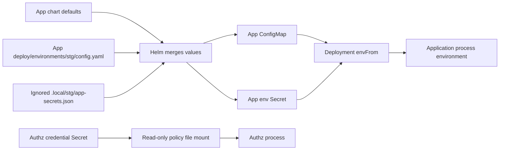
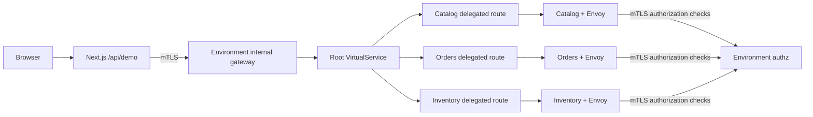

# Mesh Lab

A runnable local Kubernetes case study. Next.js 16.3.4 with strict TypeScript, seven business APIs across **three languages** (Go, Node.js, Python) speaking REST, GraphQL and gRPC, a Go WebSocket event service, RabbitMQ carrying telemetry, Prometheus and Grafana collecting metrics, and centralized Istio authorization. Every application owns its source, Dockerfile, Helm manifests, routes, security policies and environment settings.

Everything is real: the browser interface drives live requests through the mesh, shows the decisions Envoy and the shared authz service actually made, follows each telemetry message through the broker, and reads its metric counters from Prometheus.

## Install and run, from nothing

These steps assume macOS with Homebrew. Nothing here touches a remote cluster: `stg` and `prd` are two namespaces in one local Minikube profile called `mesh-study`.

```sh
# 1. Prerequisites: Docker Desktop running with ~8 GB memory, plus these runtimes.
brew install node go python3 kubectl
make tools                        # minikube, helm, istioctl, kns/ktx, fzf

# 2. Frontend dependencies (only needed for typechecking and the browser checks).
npm ci --prefix apps/web

# 3. Build everything and bring up both environments end to end.
make up-all                       # cluster, Istio, gateways, images, deploy, smoke

# 4. Point kubectl at local staging and look around.
make use ENV=stg
kubectl get pods

# 5. Open the interface. Keep this terminal running.
make port-forward ENV=stg         # prints the actual URL, starting at :3000
```

`make up-all` takes roughly 10-20 minutes on a first run, mostly image builds. To do it one step at a time instead:

```sh
make cluster                      # start the mesh-study Minikube profile
make mesh                         # namespaces, Istio base and istiod
make gateway ENV=stg              # the environment's internal gateway
make secrets ENV=stg              # generate .local/stg credentials (once)
make build                        # build and load every application image
make deploy ENV=stg               # render and apply the whole environment
make restart ENV=stg              # roll pods when an image tag was reused
make smoke ENV=stg                # verify allow, deny, bypass and outage behaviour
```

Repeat the `ENV=prd` variants for the production simulation, or use `make up-all` which does both.

### Everyday commands

```sh
make port-forward ENV=stg         # the studio, starting at :3000
make grafana ENV=stg              # Grafana dashboards, starting at :3200
make tokens ENV=stg               # print the local demo credentials
make logs APP=catalog ENV=stg     # application logs
make status ENV=stg               # pods, services and routes
make deploy ENV=stg               # apply configuration changes
make watch ENV=stg                # auto-apply local deployment edits
make test                         # Go race tests, typecheck, catalog fixtures
make lint                         # both catalogs and both environment charts
make smoke-all                    # both environments plus isolation checks
```

`make port-forward` (alias `make serve`) binds loopback only, starts at port 3000 for staging or 3001 for the production simulation, automatically tries the next free port when one is occupied, and prints the real URL. Use `PORT=3002` to pick a different starting point and Ctrl+C to stop. A rollout replaces the pod behind a forward, so restart it after `make restart`.

### Tearing down

```sh
make stop                         # stop the local profile, keep its state
make delete                       # destroy the profile entirely
```

`make cluster` uses `--keep-context`, so starting the study never silently changes which cluster your `kubectl` points at. Use `make use ENV=stg`, or `ktx mesh-study` and `kns stg`, to switch deliberately.

## What runs in each environment

| Workload | Language / image | Protocol | Reached through |
| --- | --- | --- | --- |
| `web` | TypeScript, Next.js | HTTP + WebSocket | loopback port-forward |
| `catalog`, `orders`, `inventory` | Go | REST | internal gateway |
| `payments` | Node.js | REST | internal gateway |
| `reviews` | Python | REST | internal gateway |
| `graphql` | Go | GraphQL | internal gateway |
| `grpc` | Go | gRPC over HTTP/2 | internal gateway |
| `authz` | Go | HTTP | Istio `CUSTOM` provider only |
| `events` | Go | WebSocket | internal gateway |
| `rabbitmq` | upstream image | AMQP | in-mesh only |
| `prometheus` | upstream image | HTTP | in-mesh only |
| `grafana` | upstream image | HTTP | loopback port-forward |

The three upstream images are deployed but never built here: `make build APP=rabbitmq` refuses, and a command-line `TAG` is not applied to them. Select their versions in `apps/<name>/deploy`.

Demo roles: **admin** may read everything; **reader** may read catalog, inventory, reviews and GraphQL, but not orders, payments or the gRPC quote. Missing and invalid credentials are refused for everything.

## Folder ownership

```text
apps/
  catalog/                         # same structure for orders, inventory, authz
    main.go
    go.mod
    Dockerfile
    deploy/
      README.md                    # app-specific settings and injection guide
      helm/
        Chart.yaml
        values.yaml                # app defaults
        values.schema.json
        templates/
          deployment.yaml
          service.yaml
          service-account.yaml
          config/
            config-map.yaml
            env-secret.yaml
          routes/
            virtual-service.yaml   # this app's delegated route
            destination-rule.yaml
          security/
            allow-gateway.yaml
            external-authorization.yaml
      environments/
        stg/
          values.yaml              # replicas, image, route timeout, resources
          config.yaml              # non-sensitive runtime variables
          secrets.example.yaml     # documentation only; never loaded automatically
        prd/
          values.yaml
          config.yaml
          secrets.example.yaml
  web/                             # Next.js source + same deploy/ layout
  shared/httpapi/                   # Go HTTP lifecycle utility; no auth logic

deploy/
  helm/
    platform/                      # root chart loads each app chart via dependencies
      Chart.yaml
      templates/
        routes.yaml                # general route delegates to app-owned routes
        gateway.yaml
        security/                  # environment-wide default deny and strict mTLS
    namespaces/                    # shared namespace provisioning
  environments/
    stg/                           # global topology + gateway replica settings
    prd/
  istio/                           # shared control-plane and gateway Helm values
scripts/                           # build/deployment verification helpers
Makefile
```

`deploy/` clearly identifies deployment configuration. Helm defines the files inside a chart, but does not prescribe a parent directory name: see [Helm chart structure](https://helm.sh/docs/topics/charts/).

Chart dependencies use paths such as `file://../../../apps/catalog/deploy/helm`, relative to `deploy/helm/platform/`. They work on another machine when the repository structure is preserved. `make deps` packages them into the ignored `deploy/helm/platform/charts/` directory. Helm sends rendered resources to Kubernetes; Kubernetes never reads those filesystem URLs. For separate repositories, publish versioned charts to a Helm/OCI registry.

## How settings enter each app



Values are loaded in this order; later values win:

1. Each app's `deploy/helm/values.yaml` defaults and root platform defaults.
2. `deploy/environments/<env>/values.yaml` for shared topology.
3. Each app's `deploy/environments/<env>/values.yaml`, `config.yaml`, and optional `policy.yaml`.
4. Ignored `.local/<env>/<app>-secrets.json` or `.yaml` files for real deployment only.
5. Explicit `TAG=...` overrides all app image tags, if supplied.

App environment files are wrapped under their dependency name (`catalog:`, `web:`, etc.) because they are loaded into the root chart. The script `scripts/helm_environment.py` lists every input explicitly; example secret files are never globbed into deployment.

For example, change `apps/catalog/deploy/environments/stg/config.yaml`:

```yaml
catalog:
  config:
    SERVICE_VERSION: "v2-experiment"
    READ_TIMEOUT_SECONDS: "15"
    SHUTDOWN_TIMEOUT_SECONDS: "5"
```

Then run `make deploy ENV=stg`. Helm renders `catalog-config`. The catalog Deployment imports its keys through `envFrom.configMapRef`, and Go reads them with `os.Getenv`. Its checksum annotation changes, so Kubernetes rolls out **catalog only**, without rebuilding an image. `prd` retains its own settings. `APP_ENV`, HTTP port and the internal gateway URL are generated by the chart and cannot be redefined in `config`.

For optional sensitive environment variables, copy an app's secret example into `.local/<env>/<app>-secrets.yaml`, fill only the variables your app actually consumes, and set file permissions to 0600. Helm creates `<app>-env` only when the `secrets` map is nonempty; the Deployment imports it through `envFrom.secretRef`. The sample business APIs do not need passwords, so they do not get empty placeholder Secrets.

Alternatively, set the app's `existingEnvSecret` to a Secret managed outside this chart. Changing the contents of an externally managed Secret requires `make restart APP=<app> ENV=<env>`; the chart cannot checksum an external resource. Do not define the same variable in config and a chart-managed Secret; templates reject conflicts. An externally managed Secret should also contain only non-conflicting sensitive keys.

Authz credentials use a **separate mounted Secret**, not environment variables: `.local/stg/authz-secrets.json` → `authz-policy` → `/etc/authz/policy.json`. `AUTHZ_POLICY_PATH` tells authz where to read it. Allowed paths live in `apps/authz/deploy/environments/<env>/policy.yaml`. Credentials and policy changes trigger an authz rollout automatically.

## Build-time versus runtime

The **same Docker image** is deployed to staging and production. No environment credentials are passed as Docker build args. Both root and web `.dockerignore` files exclude deployment settings, local secret directories, and `.env` files from their build contexts. Kubernetes injects environment-specific values at pod creation.

The web Dockerfile contains only portable process defaults (`NODE_ENV`, `HOSTNAME`, `PORT`, and disabling Next.js telemetry). Go images have no environment-specific defaults baked in. `SERVICE_VERSION` is a configurable API response label, not the image tag or a build provenance identifier.

Next.js server routes read `process.env` at request time. Client-side `NEXT_PUBLIC_*` variables would be embedded during `next build`, so this example deliberately uses `/api/runtime-config` to expose only `environment` and `title`. The route has an explicit allowlist and no caching. Tokens and internal API URLs are never returned by it. Browser tokens remain in page memory and are forwarded by the Next.js server to the mesh.

| App | Runtime setting | Effect |
|---|---|---|
| All | `APP_ENV` | Environment label, injected from the selected namespace configuration |
| Go apps | `HTTP_PORT` | HTTP listener, managed by the chart at 8080 |
| Go apps | `READ_TIMEOUT_SECONDS` | HTTP request read timeout |
| Go apps | `SHUTDOWN_TIMEOUT_SECONDS` | Graceful shutdown deadline |
| Business APIs | `SERVICE_VERSION` | Version label returned with data |
| Authz | `AUTHZ_POLICY_PATH` | Location of the mounted credentials/policy file |
| Web | `INTERNAL_API_URL` | Environment-local internal gateway; server-only |
| Web | `UPSTREAM_TIMEOUT_MS` | Server-side fetch deadline |
| Web | `SITE_TITLE` | Public runtime page title |

See each app's `deploy/README.md` for the exact files, injection mechanisms, and commands.

## Routes and authorization



`deploy/helm/platform/templates/routes.yaml` is the general route. Its root matches (`/catalog`, `/orders`, `/inventory` prefixes) delegate to each app's exact-path `VirtualService`. The app owns its route timeout, destination and `DestinationRule`. Only one level of [Istio delegation](https://istio.io/latest/docs/reference/config/networking/virtual-service/#Delegate) is used. App delegates omit `hosts`/`gateways` and are exported only inside their environment namespace.

Web owns its outbound gateway `DestinationRule`; authz owns its mTLS destination and access policy, but is not exposed in the general route. The internal gateway uses `ISTIO_MUTUAL` on 8443 behind a ClusterIP service on port 80. Next.js sends HTTP and its sidecar originates mTLS with explicit gateway SNI. Gateway selectors include the environment label so one environment's gateway does not load the other environment's listeners.

Each business API owns both `ALLOW` and `CUSTOM` policies. Both must pass: only that environment's gateway service account may call the API, and the environment-specific shared authz service must approve the token/path. The root chart sets strict mTLS and default deny. The control plane registers independent `study-authz-stg` and `study-authz-prd` providers.

| Request | Catalog | Orders | Inventory |
|---|---|---|---|
| Own environment's admin token through web/gateway | 200 | 200 | 200 |
| Own environment's reader token | 200 | 403 | 200 |
| Missing, invalid, or other environment's token | 403 | 403 | 403 |
| Direct web-to-API bypass with valid token | 403 | 403 | 403 |
| Authz unavailable | 503 | 503 | 503 |

The aggregate `/api/demo` endpoint returns HTTP 200 with each upstream status in its JSON body. The business APIs contain no authorization logic. Health probes are rewritten by Istio. Users with pod exec/port-forward or cluster admin privileges remain trusted administrators.

## Daily commands

```sh
make build APP=catalog                 # build and load only catalog:dev
make restart APP=catalog ENV=stg       # needed when deliberately reusing the dev tag
make deploy ENV=stg                    # apply manifest/config/policy changes
make build TAG=experiment-1            # build all apps with an explicit tag
make deploy ENV=stg TAG=experiment-1    # use the new tag; no restart needed
make render ENV=prd                    # full rendered manifests with dummy credentials
make config APP=catalog ENV=stg        # ConfigMap only; never prints secrets
make logs APP=catalog ENV=stg
make authz-logs ENV=prd
make status ENV=stg
make analyze ENV=stg
make test
make lint                             # both environment configurations
make smoke ENV=stg                    # includes a brief authz outage, restored afterward
make smoke-all                        # both environments plus cross-environment isolation
make stop                             # stop only Minikube profile mesh-study
make cluster                          # restart the profile
make delete                           # remove the entire local Minikube profile
```

Per-app image tags in the environment files are the durable deployment configuration. A command-line `TAG` overrides them only for that invocation. Set tags in those files before future deploys if you want to keep a promoted version. One root `study` Helm release composes all apps per namespace; `make deploy` upgrades that whole environment, while Kubernetes only rolls workloads whose pod templates changed. `make restart APP=...` acts on one Deployment. Do not independently install a child chart into a namespace where the root release already owns its resources.

The `stg` defaults use one replica per app/gateway; `prd` uses two. This is still a single-node local simulation, not production high availability. Static tokens, mock data, and no database keep the case study small. Future additions can include OIDC/JWT, OPA, databases, tracing, and canary routing without adding authorization code to the business APIs. Kubernetes Secrets and Helm release history contain local credentials and can be read by cluster administrators.

## Interactive protocols and live events

The dashboard now includes five business APIs: the original REST apps, an independent Go **GraphQL** product service, and an independent Go **gRPC** shipping service. `apps/graphql/deploy/` and `apps/grpc/deploy/` own their complete charts, routes, security policies and stg/prd overrides. They are dependencies of the environment's single `study` release.

Choose **Demo admin** or **Demo reader** in the request identity selector; pasting `make tokens` output into the expandable token tools is optional. These are deliberately open local demo identities, not a login. `web.demoTokens.enabled` defaults to false and is enabled in both local environment files. The root chart creates a dedicated `web-demo-tokens` Secret from that environment's authz credentials; web mounts it read-only. The same-origin POST `/api/demo-token` reads it at request time and returns only the selected token with no-store headers. `/api/runtime-config` still exposes only title/environment. Disable demo access before adapting this app to a public deployment.

The GraphQL editor supports query presets, variables, schema discovery and query errors. Its query-only schema exposes `environment` and `products(maxPrice: Float) { id name price }`. The shipping form calls `/shipping.v1.ShippingService/Quote` using native Protobuf gRPC from Next.js over HTTP/2 through the same Istio gateway. The canonical contract is `apps/grpc/proto/shipping.proto`; the web build carries a matching copy in `apps/web/proto/`. Admin can use both protocols; reader can query GraphQL but cannot call shipping. Missing, invalid and other-environment credentials remain denied. Authorization permits POST only for these exact new paths; REST remains GET-only.

**Explore the mesh** displays discovered services and real authorization check/allow/deny and service received/completed events, with service filters, pause/resume controls and request correlation. Each call gets an `x-mesh-request-id`, also passed to authz by the Istio providers. The gateway node is visual routing context, not a fabricated gateway event. Events carry metadata only, never bearer tokens or request/response bodies.

`apps/events/` is a separate Go WebSocket application with its own chart. Trusted environment-local workloads post metadata to `/ingest`; only the environment's gateway may reach `/events`, and authz checks its token. The web custom Node server bridges same-origin `/api/events` WebSocket connections to the gateway. The browser supplies its token in the first frame, never in a URL. Both demo identities may observe their environment's feed. Authorization is checked at connection establishment; reconnect after credential changes to reauthorize.

This event stream is best-effort: producer queues, slow-client buffers, and the 200-event replay history are bounded. Events may be dropped under load, and restarts clear history. Events uses **one replica in both local environments** so replay and subscriptions share one process. It is a lightweight in-memory pub/sub example, not a durable Kafka/RabbitMQ deployment. Business traffic continues when telemetry is unavailable.

## Local automatic deployment

```sh
make watch ENV=stg   # foreground; save Helm/config files to redeploy local staging
```

The watcher targets only local context `mesh-study`. It watches app charts, the root platform chart, selected-environment settings and local secret files, debounces saves, then runs `make deploy ENV=...`. Failed applies retry on the next edit. It does not run implicitly, watch another environment's settings, rebuild source code, or deploy to any remote/live cluster. Ctrl+C stops it. Source changes still require `make build APP=...` followed by `make restart APP=... ENV=...` when reusing a tag. Shared Istio, namespace and gateway changes need their explicit `make mesh` / `make gateway` commands.

## Event broker

Telemetry is carried by a RabbitMQ instance per environment, deployed from `apps/rabbitmq/deploy` like any other app but from the upstream image: there is no source folder, `make build APP=rabbitmq` refuses, and a command-line `TAG` never touches it.

Every business API and the authorization service publish to the `mesh.events` topic exchange with routing key `<environment>.<service>.<stage>`. The events service binds the durable queue `mesh.events.<environment>` with `#`, consumes with a prefetch of 50, and acknowledges after fan-out to its WebSocket subscribers. Publishing is best effort on a bounded in-process channel: if the broker is unavailable the events are dropped, the business request still succeeds, and the interface shows the broker as reconnecting.

```sh
make secrets ENV=stg                  # generate .local/stg/rabbitmq-secrets.json once
make logs APP=rabbitmq ENV=stg
```

The broker listens on AMQP 5672 only. It has no VirtualService and no gateway route, so nothing outside the mesh can reach it, and the management plugin is not enabled — the events service reads queue depth with a passive queue declaration. Because the Service port is named `tcp-amqp`, Istio treats the traffic as TCP: client sidecars still originate `ISTIO_MUTUAL`, but the authorization policy can only match workload identity and port, not paths or methods. That is the intended contrast with the HTTP services, which additionally pass a `CUSTOM` external check.

Storage is an `emptyDir` and restarts start from an empty queue. This is an observation-scale broker for a learning environment, not a durable audit log.

## Metrics and dashboards

Every application exposes `/metrics` in Prometheus exposition format on its own port — the Go services through `apps/shared/telemetry`, `payments` through `telemetry.js`, `reviews` through `telemetry.py`, all publishing the same series: `mesh_requests_total`, `mesh_request_duration_seconds`, `mesh_events_published_total` and `mesh_build_info`.

Collection is a **pull**, and it never crosses the authorization boundary. `meshConfig.enablePrometheusMerge` makes each sidecar scrape its own application locally and serve the result — merged with Envoy's own `istio_*` series — on port 15020, which is exempt from mTLS and from AuthorizationPolicy. Prometheus discovers one target per pod with a namespace-scoped Role, so it needs no credentials and no cluster-wide permissions. It is the only workload in the study that mounts a service account token.

Grafana provisions a read-only Prometheus datasource and a dashboard covering handler throughput, mesh decisions by response code, p95 handler latency and telemetry publish rate.

```sh
make grafana ENV=stg              # prints the generated login, forwards to :3200
```

Neither service has a gateway route, so nothing outside the cluster can reach them. The studio's own numbers come from `apps/web/app/api/learn/metrics/route.ts`, which runs a fixed allowlist of queries server-side: the browser never sends PromQL and never talks to Prometheus directly.

## Learning studio

The home page is one dark map of the mesh, and the map owns the screen. Inside a cluster frame and a namespace frame you see the browser, the Next.js pod, the internal gateway, every deployed service in its own dashed **pod boundary** holding two containers — the Envoy sidecar and the application — the shared authz service, a metrics lane pulling to Prometheus and Grafana, and a telemetry lane running through RabbitMQ and back to the browser.

Everything else opens on a button, and every panel is a full-height column beside the map rather than a box on top of it. **Console** and **Inspector** share one column on the right, switched by tabs: the console holds the operation form, the request journey and the flight log; the inspector holds the source and explanation tabs. **Send** opens a column on the left with the five identities — admin, reader, no token, invalid token, custom token, the active one marked and explained — and one trigger per deployed operation. The service list on the far left collapses to a narrow tab when you want the whole width. Nothing is hidden behind a mode switch: there is one workspace.

Each service in the list has an eye toggle. Hiding one removes it from the map, from the send column and from “run all services” — a view filter only, nothing is undeployed — and **Show all** brings them back.

The flight log is a list of the last 50 requests with status, service, identity and time; **View all** opens the full history in a modal, and picking a row selects that request in the console.

Each service gets its own accent colour, assigned by position, applied to its pod, sidecar, boundary and lines, so a lane can be followed at a glance. Language is shown as a badge on the pod (`GO`, `JS`, `PY`) and spelled out in the service list.

Navigation works like a design tool: drag to pan, scroll to pan, `⌘`/`ctrl` + scroll to zoom at the pointer, a minimap in the corner with a draggable viewport rectangle, and zoom controls with a `Fit` button.

Clicking any node opens the inspector on a **Tech** tab that explains what that technology is, what it does in this mesh, and a few checkable facts, beside a mark in the project's own colours. The other tabs are Explain (the request step, plus the four Istio resources that decide the call), Source, Rendered YAML, and **Layers** — the stack from cluster down to the two containers in the pod, read from the rendered manifests. The node is deliberately absent there: the browser has no Kubernetes API access and will not invent one.

Dispatching a request sends a glowing parcel along the configured route. It stops at the destination Envoy's authorization branch and waits there until a decision is actually known — from a correlated `authz` event when telemetry is connected, otherwise from the response status — then continues to the handler on allow or turns back on deny. Each pod shows its live handled count straight from Prometheus, and a scrape mote is only drawn when that counter actually grows. Motion always represents the configured route; the badges in the journey panel report measured evidence.

“Run all services” adds independent requests to that flight log, capped at 50 entries in page memory. Replay and step controls present captured activity without issuing requests. The observer keeps its own credentials, so testing missing or invalid request tokens keeps the WebSocket connected. Reduced-motion preferences disable the packet animation entirely; the journey panel remains the complete non-animated account. The map is SVG and needs no WebGL. Below roughly 900px it switches to a single-lane layout for the selected service.

Gateway and Envoy steps describe configured routing, not captured spans. Authz branches from the destination Envoy; the event service is a separate observation channel. Missing events mean “not observed.” The inspector shows approved source, moving anchor highlights, sanitized rendered resources, and their contributing values files. Workspace revision, last configuration apply, and observed workload build revision remain distinct.

```sh
make learn-sync ENV=stg    # publish current approved source once
make learn-watch ENV=stg   # foreground source watcher; Ctrl+C stops
```

An optional `apps/<app>/learn.yaml` describes operations and lessons; the root Helm dependency list discovers services, including those without examples. See [the descriptor contract](apps/web/deploy/README.md#learning-descriptor-contract). Adding a descriptor does not create mesh routes or permissions. Operations become executable only after `make deploy`; source-only synchronization preserves the activated catalog and disables edited operation definitions until another deployment.

`study-learning` is a separate Helm release owning only the `learning-catalog` ConfigMap in each local environment. It owns no application resources. Web reads the projected bundle per request; Kubernetes propagates ConfigMap updates asynchronously, then the browser polls every four seconds. Source updates do not rebuild images or restart workloads. Deployment and synchronization share a per-environment lock. Invalid anchors, missing registered files, invalid operations and oversized bundles fail before publication, retaining the last valid bundle.

`make test` includes offline catalog fixtures and journey-state checks. `make lint` validates both catalogs and both environment charts. `make smoke` checks individual operations and all four request identities as well as existing bypass, outage, and WebSocket checks. Browser acceptance can be run with `node scripts/check_studio.cjs <loopback-url>` when Playwright is installed (set `PLAYWRIGHT_MODULE` to its module location if needed).

The mission-deck rollout selects explicit image tags in each app's environment `values.yaml`. When rebuilding one app, pass its configured `TAG` and restart that app, or select a new tag in its environment file before deploying. `make build APP=...` still defaults to `dev`; it does not replace a differently tagged running image.
